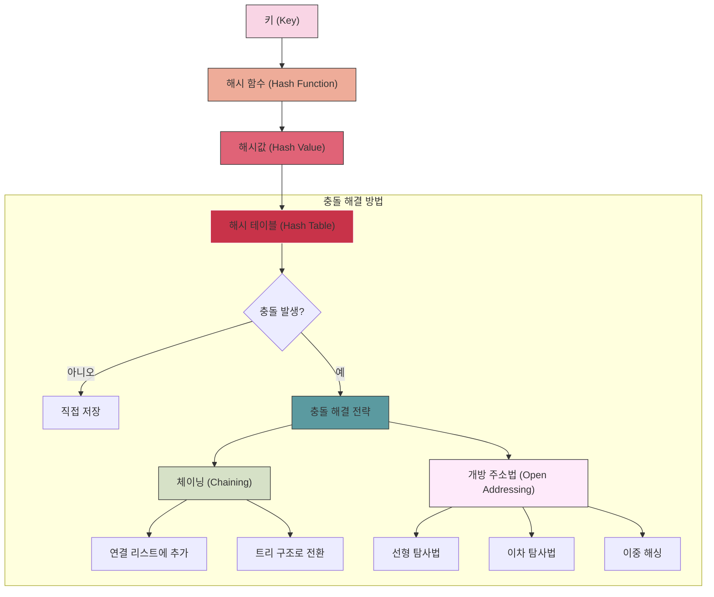

# 해시(Hash)의 개념과 알고리즘

## 중요 키워드 정리

- **해싱(Hashing)**: 키를 사용해 데이터를 저장하고 검색하는 효율적인 방법
- **해시 함수(Hash Function)**: 키를 고정된 범위의 값으로 변환하는 함수
- **해시 테이블(Hash Table)**: 해시 함수의 결과를 배열 인덱스로 활용하는 자료구조
- **해시 충돌(Hash Collision)**: 서로 다른 키가 동일한 해시값을 가지게 되는 현상
- **해시 체인(Hash Chain)**: 충돌 문제를 연결 리스트를 사용해 해결하는 기법

## 해싱(Hashing)

해싱은 **임의의 길이를 가진 데이터를 고정된 길이의 값으로 변환하는 과정**이다. 이는 대용량 데이터에서 원하는 정보를 빠르게 검색하기 위한 핵심 기술로, 데이터를 저장하고 검색하는 시간 복잡도를 평균적으로 O(1)로 단축시킨다. 해시 함수를 통해 키를 해시값으로 변환하고, 이 값을 인덱스로 사용하여 데이터를 저장한다.

## 해시 함수(Hash Function)

해시 함수는 **키를 해시 테이블의 인덱스로 변환하는 함수**이다. 좋은 해시 함수는 다음 조건을 만족해야 한다:

1. **계산 효율성**: 빠르게 계산될 수 있어야 한다.
2. **균등 분포**: 키를 해시 테이블에 균등하게 분산시켜야 한다.
3. **일관성**: 같은 키는 항상 같은 해시값을 반환해야 한다.
4. **충돌 최소화**: 서로 다른 키에 대해 다른 해시값을 반환하는 것이 이상적이다.

대표적인 해시 함수 기법:

- **나머지 연산(Modulo)**: `hash(key) = key % tableSize`
- **폴딩(Folding)**: 키를 여러 부분으로 나누어 연산 후 조합
- **중간 제곱법(Mid-Square)**: 키를 제곱한 후 중간 부분을 추출
- **곱셈 해시(Multiplication)**: `hash(key) = floor(tableSize * (key * A mod 1))` (A는 0과 1 사이의 상수)

## 해시 테이블(Hash Table)

해시 테이블은 **해시 함수를 사용하여 키를 배열의 인덱스로 매핑하는 자료구조**이다. 키-값 쌍을 저장하며, 해시 함수를 통해 키가 어느 버킷(배열 요소)에 저장될지 결정한다. 해시 테이블의 크기는 보통 소수(Prime Number)로 선택하는데, 이는 충돌을 줄이고 해시값이 더 고르게 분포되도록 돕는다.

## 해시 충돌과 해결 방법

### 해시 충돌(Hash Collision)

서로 다른 키가 동일한 해시값(인덱스)을 가지게 되는 현상이다. 해시 테이블의 크기는 유한하지만 키의 개수는 무한할 수 있기 때문에 발생하는 필연적인 문제다.

### 1. 체이닝(Chaining)

체이닝은 **각 버킷에 연결 리스트나 트리를 사용하여 여러 항목을 저장하는 방식**이다.

**장점:**

- 구현이 상대적으로 단순하다.
- 테이블이 채워지는 정도(로드 팩터)에 덜 민감하다.
- 삭제 연산이 간단하다.

**단점:**

- 추가적인 메모리가 필요하다 (포인터 저장).
- 캐시 효율성이 떨어질 수 있다.
- 최악의 경우 O(n) 시간이 소요될 수 있다.

**개선 사항:**

- 연결 리스트의 길이가 특정 임계값을 초과하면 트리(Red-Black Tree 등)로 전환하여 최악의 경우에도 O(log n) 성능을 보장할 수 있다 (Java HashMap에서 활용).

### 2. 개방 주소법(Open Addressing)

개방 주소법은 **충돌 발생 시 다른 빈 버킷을 찾아 데이터를 저장하는 방식**이다.

**주요 기법:**

1. **선형 탐사법(Linear Probing)**: 충돌 발생 시 순차적으로 다음 슬롯을 검사

   ```
   h(key, i) = (h'(key) + i) % tableSize
   ```

2. **이차 탐사법(Quadratic Probing)**: 탐색 간격이 제곱으로 증가

   ```
   h(key, i) = (h'(key) + c₁*i + c₂*i²) % tableSize
   ```

3. **이중 해싱(Double Hashing)**: 두 번째 해시 함수로 탐색 간격 결정

   ```
   h(key, i) = (h₁(key) + i*h₂(key)) % tableSize
   ```

**장점:**

- 추가 메모리가 필요 없다.
- 캐시 지역성(locality)이 좋다.
- 데이터가 테이블 내에 직접 저장된다.

**단점:**

- 클러스터링(데이터 군집화) 현상이 발생할 수 있다.
- 로드 팩터가 0.7 이상이면 성능이 급격히 저하된다.
- 삭제 연산이 복잡하다 (특별한 표시가 필요).

## 해시 테이블의 성능과 최적화

### 로드 팩터(Load Factor)

해시 테이블의 채워진 정도를 나타내는 지표로, `적재율 = 항목 수 / 테이블 크기`로 계산한다. 일반적으로:

- 체이닝: 로드 팩터가 1을 넘어도 동작 가능
- 개방 주소법: 로드 팩터를 0.7 이하로 유지하는 것이 권장됨

### 재해싱(Rehashing)

테이블이 일정 비율 이상 채워지면 더 큰 크기의 새 테이블을 만들고 모든 데이터를 새 해시 함수로 다시 삽입하는 과정이다. 이는 충돌을 줄이고 성능을 유지하는 데 필수적이다.

### 완전 해시(Perfect Hashing)

모든 키가 서로 다른 슬롯에 매핑되어 충돌이 전혀 발생하지 않는 이상적인 상황이다. 키 집합이 사전에 알려져 있고 변하지 않는 경우에만 가능하다.

## 해시 테이블 구현 예시 (JavaScript)

```javascript
class HashTable {
  constructor(size = 53) {
    this.table = new Array(size);
    this.size = size;
    this.count = 0;
    this.loadFactorThreshold = 0.7;
  }

  // 해시 함수
  hash(key) {
    const stringKey = String(key);
    let total = 0;
    const PRIME = 31;

    for (let i = 0; i < Math.min(stringKey.length, 100); i++) {
      const char = stringKey[i];
      const value = char.charCodeAt(0) - 96;
      total = (total * PRIME + value) % this.size;
    }

    return total;
  }

  // 데이터 삽입
  set(key, value) {
    // 로드 팩터 확인 및 재해싱
    if ((this.count + 1) / this.size > this.loadFactorThreshold) {
      this.rehash();
    }

    const index = this.hash(key);

    if (!this.table[index]) {
      this.table[index] = [];
    }

    // 이미 존재하는 키인지 확인
    for (let i = 0; i < this.table[index].length; i++) {
      if (this.table[index][i][0] === key) {
        this.table[index][i][1] = value;
        return;
      }
    }

    // 새 키-값 쌍 추가
    this.table[index].push([key, value]);
    this.count++;
  }

  // 데이터 검색
  get(key) {
    const index = this.hash(key);

    if (!this.table[index]) return undefined;

    for (let i = 0; i < this.table[index].length; i++) {
      if (this.table[index][i][0] === key) {
        return this.table[index][i][1];
      }
    }

    return undefined;
  }

  // 데이터 삭제
  remove(key) {
    const index = this.hash(key);

    if (!this.table[index]) return false;

    for (let i = 0; i < this.table[index].length; i++) {
      if (this.table[index][i][0] === key) {
        this.table[index].splice(i, 1);
        this.count--;
        return true;
      }
    }

    return false;
  }

  // 재해싱
  rehash() {
    const oldTable = this.table;
    this.size = this.size * 2 + 1; // 소수에 가까운 값으로 증가
    this.table = new Array(this.size);
    this.count = 0;

    // 기존 데이터 재삽입
    for (let i = 0; i < oldTable.length; i++) {
      if (oldTable[i]) {
        for (let j = 0; j < oldTable[i].length; j++) {
          this.set(oldTable[i][j][0], oldTable[i][j][1]);
        }
      }
    }
  }

  // 키 목록 반환
  keys() {
    const keysArray = [];

    for (let i = 0; i < this.table.length; i++) {
      if (this.table[i]) {
        for (let j = 0; j < this.table[i].length; j++) {
          keysArray.push(this.table[i][j][0]);
        }
      }
    }

    return keysArray;
  }
}
```

## 개념 관계도



## 해시 알고리즘의 활용 사례

1. **데이터베이스 인덱싱**: 빠른 데이터 검색을 위해 인덱스를 구현한다.
2. **캐싱(Caching)**: 웹 브라우저, CDN, 데이터베이스에서 빠른 데이터 접근을 위한 캐시로 활용된다.
3. **암호화**: 비밀번호 저장(해시 함수로 암호화), 디지털 서명에 사용된다.
4. **블록체인**: 트랜잭션 데이터의 무결성을 보장하는 데 활용된다.
5. **중복 검사**: 대용량 데이터에서 중복 항목을 빠르게 식별한다.
6. **분산 시스템**: 데이터를 여러 서버에 분산하는 일관된 해싱(Consistent Hashing)에 활용된다.

## 시간 복잡도 분석

| 연산 | 평균 | 최악 |
| ---- | ---- | ---- |
| 삽입 | O(1) | O(n) |
| 검색 | O(1) | O(n) |
| 삭제 | O(1) | O(n) |

- 최악의 경우는 모든 키가 동일한 해시값을 가질 때 발생한다.
- 체이닝에서 트리 구조를 사용하면 최악의 경우 O(log n)으로 개선된다.

## 결론

해시 알고리즘은 대용량 데이터에서 효율적인 검색을 가능하게 하는 핵심 기술이다. 해시 함수의 품질, 충돌 해결 전략, 테이블 크기 관리가 해시 테이블의 성능을 결정한다. 일반적으로 평균 O(1)의 시간 복잡도를 제공하지만, 충돌 처리 방식과 해시 함수의 선택에 따라 성능이 크게 달라질 수 있다. 알고리즘 설계 시 데이터의 특성과 사용 패턴을 고려하여 적절한 해시 전략을 선택하는 것이 중요하다.
